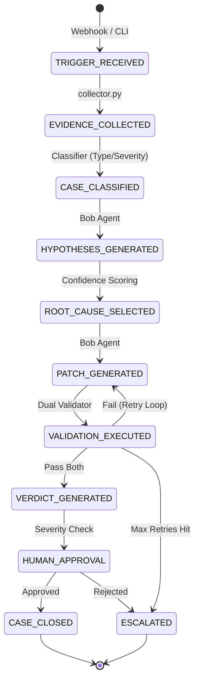
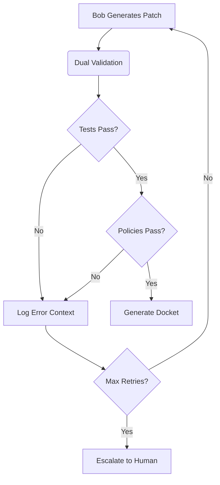

# 🏛️ The Governance Tribunal — Architecture & Logical Model

## The 8-Layer Logical Capability Model

The Tribunal operates on an 8-layer cognitive loop executed by IBM Bob 2.0 and the Orchestrator.

1. **Perception:** Triggers on CI failure or policy scan failure.
2. **Contextualization:** Gathers test stack traces, policy Markdown docs, and git blame history.
3. **Hypothesis Generation:** Synthesizes evidence to predict root cause (e.g., "Commit 7a9b2 leaked PII during a quick bug fix").
4. **Reproduction:** Confirms the bug/violation locally using Docker sandboxing.
5. **Remediation:** Generates a patch via LLM coding capabilities.
6. **Dual Validation (The Appeals Process):** Runs BOTH functional tests and policy scanners against the proposed patch.
7. **Governance Gate:** Routes through automated confidence thresholds; triggers Human-in-the-loop for high-risk files.
8. **Reporting:** Generates the immutable JSONL Audit Ledger and Markdown Tribunal Docket.

## State Machine (10 States)

The orchestrator guarantees deterministic execution across these states:

## Dual Validation Core Innovation

The core innovation is treating **tests** and **policies** as equals in the CI pipeline. A patch is only accepted if it satisfies both domains:

